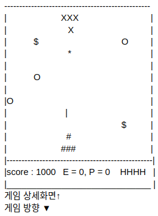

## 맞춤 콘솔게임프로젝트
<Br><br>

  
**팀명 - 통 수 팟**

*   조장 - 조국현
*   팀웜 - 손상훈
*   팀원 - 황문섭
*   팀원 - 박건진

<br><br>

----

## INDEX
*    ### 개발 환경
*    ### 페이지 구성
*    ### 상세 내용

<br>

```
본 프로젝트는 게임을 구현 한 것입니다.

    1.  게임 메뉴 - 맞춤 메뉴 활성화
    2.  게임 기능 구현

```
<br><br>
# 개발 환경
### - OS : Ubuntu 20.04
### - Language : C++
### - Tools : VS code

<br><br>
# 초안 구성
<br>
##싱글 게임<br>
##겔러그<br>

게임 시작화면 -> 스토리 -> 게임화면 -> 게임 승리 -> 엔딩 스토리 -> 게임 시작화면<br>
                             ㄴ> 게임 오버 -> 게임 시작화면 
<br><br>
생명력 - H<br>
무적 - P<br>
에너지 - E<br>

적군 - 종류 3가지<br>
아군 - 기술 2 ~ 3가지 정도
<br><br><br>
## Structure 종류 및 구성
<br><br><br>
### Enemy_info = 적 정보
* Hp
* 미사일 발사체(발사체 속도)
* 위치
* 적 넘버
* 바디정보
<br><br><br>
### ETC = 아이템 정보
* 아군 습득 정보
* 장애물 객체 정보
<br><br><br>
### Player_info = 아군 정보
* Hp
* 미사일 발사체(발사체 종류 및 데미지)
* 위치
* 바디정보
* Score 정보
<br><br><br>
### mapFrame = 맵정보
* 맵 정보

<br><br><br><br>
## 구성 화면(초안)
<br><br><br>
  
<br><br><br>

